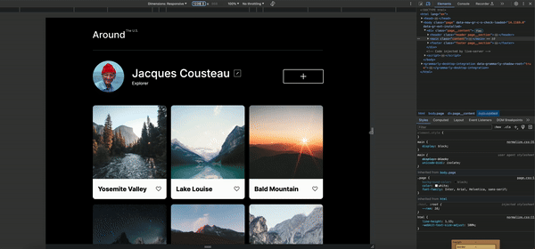

# Around the U.S.

This is an interactive page where users can add and remove photos, like photos of other users, and make a few minor adjustments to their own profile. This project contains HTML and CSS files for a website showcasing various locations around the United States.

https://jamespetienne.github.io/se_project_aroundtheus/

## Files Included

- **index.html**: The main HTML file containing the structure of the website.
- **index.css**: The main CSS file containing styles for the website layout and components.
- **vendor**: Directory containing external CSS files imported into the project.
  - `normalize.css`: CSS file for normalizing styles across different browsers.
  - `font.css`: CSS file for importing custom fonts.
- **blocks**: Directory containing CSS files for different components of the website.
  - `page.css`: CSS file defining styles for the main page layout.
  - `header.css`: CSS file defining styles for the header section.
  - `profile.css`: CSS file defining styles for the profile section.
  - `gallery.css`: CSS file defining styles for the gallery section.
  - `card.css`: CSS file defining styles for individual cards in the gallery.
  - `footer.css`: CSS file defining styles for the footer section.

## Usage

Simply open the `index.html` file in a web browser to view the website. All styles are included within the CSS files, and images are referenced relatively within the HTML.

## Features

- Responsive design: The website layout adjusts based on the screen size, ensuring a consistent user experience across devices.
- Profile section: Displays information about a featured individual, including their name, description, and a profile picture.
- Gallery section: Showcases multiple locations with images and titles.
- Like button: Each card in the gallery has a like button for user interaction.
- Semantic HTML5
- Grid
- Flexbox
- Media Queries

## Webpage Views

- ### Desktop

  

- ### Tablet

  

- ### Mobile

  

## Responsive Design

## Credits

- **Around The U.S.**: © 2022 Around The U.S. - Original concept and design.
- **Normalize.css**: [Normalize.css](https://github.com/necolas/normalize.css) - A modern, HTML5-ready alternative to CSS resets.
- **Inter Font**: [Inter](https://rsms.me/inter/) - The font used for text elements in the project.
